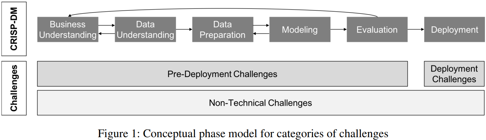

# Paper 5: CHALLENGES IN THE DEPLOYMENT AND OPERATION OF MACHINE LEARNING IN PRACTICE

---

Baier, Lucas & Jöhren, Fabian & Seebacher, Stefan. (2019). CHALLENGES IN THE DEPLOYMENT AND OPERATION OF MACHINE LEARNING IN PRACTICE.

---

# Abstract

- The translation of a prediction algorithm into an operationally usable machine learning model is a time-consuming and in various ways challenging task.
- In this work, we target to systematically elicit the challenges in deployment and operation to enable broader practical dissemination of machine learning applications.

# Introduction

- Machine learning (ML) is playing an important role in nearly all fields of business, ranging from marketing over governmental tasks to scientific-, health- and security- related applications (Chen et al., 2012).
- Many companies rely on ML models deployed in their information systems for increasing the efficiency of their processes (Schüritz et al., 2016).
- Companies which are able to leverage their data sources through analytical tools achieve a substantial competitive advantage (Davenport 2006).
- The performance differences in developed ML algorithms rapidly diminish once applied onto real applications (Rudin et al., 2014). […] This is closely related to the criticism on using unrealistic evaluation metrics (Rudin et al., 2014).
- The successful implementation of a ML project also requires the consideration of organizational aspects.
- Research Question: Which challenges in the application and deployment of machine learning can we identify in practice? For answering this question, we perform at first a structured literature review of challenges named in literature which are organized along the categories pre-deployment, deployment and non-technical challenges.

# Related work - Results - Discussion

- CRISP-DM (Wirth et al., 2000): a standard process model for data analytics projects.
- We argue for an extension of CRISP-DM because many activities such as an appropriate transfer of ML results or the ongoing monitoring and adaptation due to data drifts is not considered so far.

- After performing the literature search, we merged the identified challenges into 6 distinct clusters consisting of similar challenges: Data structure, Implementation, Infrastructure, Governance, Customer relation and Economic implications.

|  | Pre-deployment | Deployment | Non technical |
| --- | --- | --- | --- |
| Data structure | -+ Data quality
-+ Data quantity
-+ High dimensionality in data
-+ Imbalanced data
- Encrypted training data | -+ High frequency data
-+ Concept drift / Data drift |  |
| Implementation | -+ Data collection
-+ Data preprocessing
-+ Transfer learning
- Technical debt | -+ Ongoing data validation
-+ Ongoing result validation
-+ Robustness
+ Automated model updates |  |
| Infrastructure | -+ Computational effort
-+ Energy consumption | -+ Deployment infrastructure
-+ Scalabilcity | -+ User-friendly tools |
| Governance | -+ Data privacy protection
-+ Anti-discrimination validation
+ Data management |  | -+ Legal requirements
-+ Results transparency and interpretability
-+ Trust |
| Customer relation | + Domain knowledge |  | - Standardization of terminology
+ Expectation management
+ Customer / Result communication |
| Economic implications |  |  | - Real-world value of ML
+ Business impact of ML
+ Creating digital services with ML
-+ Evaluation metrics |
- Pre-deployment challenges
    - Data structure
        - Data is the fundamental basis of every ML project. The proper data structure with the right quality and also a sufficient amount of data samples is a prerequisite for a successful project.
        - Often only a small amount of data being available is a problem (Boutaba et al., 2018; Brodley et al., 2012; Garcıa-Laencina et al., 2008; Zhang et al., 2018).
        - If data is available, incomplete data, incorrect entries, or noisy features often make it difficult to achieve satisfying results (Baesens et al., 2014; Brodley et al., 2012; Kocheturov et al., 2018; Werts et al., 2000).
        - One more problem is imbalanced or biased data.
        - Applying ML on encrypted data sets is also challenging.
        - 
        - Usually, data quality is examined before the start of a new project. However, a realistic assessment whether all required data sources are available is often only possible during the project (α, γ, ε).
        - Data preprocessing is also named a fundamental problem (ε) because it is as a very time-consuming task which requires the vast majority of a project’s time. Therefore, data preprocessing needs to be automated and accelerated (θ).
        - 
        - Transforming data to the proper format usually requires a lot of manual work.
        - Several interview partners referred to projects which were discarded after project start because of poor data conditions. […] This clearly indicates the critical importance of an adequate data structure as well as an appropriate data processing.
        - There is a clear need for tools supporting the whole data pipeline.
        - Encrypted training data is another challenge only mentioned in literature.
    - Implementation
        - Transfer learning for applying models on similar tasks across various domains (Suthaharan, 2014) can be challenging due to different data distributions.
        - Additional problems during the modeling phase are the concept of technical debt, describing the additional time needed in the future to adapt unclean code compared against clean code (Sculley et al., 2015).
        - 
        - Researchers too often focus on improving algorithms by small percentage points on statistical metrics while at the same time loosing sight of the complexity in real application domain. […] Researchers should also proof the applicability of their work in real-world environments.
    - Insfrastructure
        - Infrastructure issues such as reducing the computational effort for model training and thereby lowering the memory requirements and energy consumption as well as increasing training and performance speed are often mentioned challenges with regard to the model design (Jordan et al., 2015; Saidulu et al., 2017; Shafique et al., 2017; Xie et al., 2014; Zhang et al., 2018).
    - Governance
        - Data privacy protection and data security are governance challenges that need to be considered when applying ML models (Lopes et al., 2017). Legal frameworks like the European General Data Protection Regulation increase the complexity of the deployment of well-functioning solutions (Malle et al., 2017).
        - 
        - Governance issues such as legal and access rights often play an important role.
        - Data management in companies across different industries is often organized poorly (γ, η).
        - Data access guidelines are usually very strict and complex. In general, several approvals are required to access relevant data (γ, ε, ζ ).
    - Customer relation
        - Domain knowledge is taken into account in order to increase data quality. […] Sometimes, this knowledge is also used as input for the model assumptions.
        - 
        - Knowledge of several people (e.g. domain experts) needs to be merged to properly understand the data and raise the quality level of the data in practice.
- Deployment challenges
    - Data structure
        - During deployment, incoming data arriving with high frequency and large quantity can be challenging (Polyzotis et al., 2017).
        - Concept drift, which describes a change in the distribution of input data or the distribution of the target variable, is an additional relevant challenge during deployment (Baier et al., 2019; Gama et al., 2014; Heit et al., 2016; Saidulu et al., 2017; Tsymbal, 2004; Widmer et al., 1996).
        - 
        - Data with high volume as well as drifts in the input data are frequent challenges. Although there are several technical solutions for automatically recognizing shifts within the input data, like using Kafka input streams, manual checks are done most of the time (β, δ, κ). Changes within the input data are mentioned as a problem, especially for the validation of the model results (ε). Manual model adjustments are often performed to match the models to the new data distributions. Only in one case the models are able to adapt themselves automatically to data drifts (η).
        - In case of ML model updates, it is necessary to provide a neat documentation of all models including older versions. It needs to be documented which data has been used for training the model and under which conditions the model was performing well. In addition, an easy rollback to older versions must be available. Therefore, a serving infrastructure with a proper model management is required. This allows an easy handling of different model versions as well as the opportunity to frequently update models.
        - Furthermore, automated data pipelines pose a problem since they need to be able to combine database and ML model management. Further, templates for ML models and an automated, ongoing computation of prediction scores should be included. Cloud solutions offer standardized solutions for these challenges.
    - Implementation
        - Ongoing validation is an additional challenge for the implementation of ML models in practice. Algorithms developed and validated in research environments are not automatically applicable and easily validated for large data sets during deployment (Staples et al., 2016). This applies to validating incoming data with regard to quality and completeness as well as the resulting model predictions (Polyzotis et al., 2017).
        - 
        - Ongoing validation of deployed ML solutions is mentioned as a problem. […] It is described as a time consuming, unstructured, and unstandardized process. A key solution in most cases is a dedicated monitoring approach, which is either done automatically, manually, or with a combination of both.
        - Continuous evaluation is the most important principle and a clear definition of the corresponding metrics is required.
        - Three different tests are proposed: consistency checks for the input data, continuous monitoring of the model predictions, and the effect of model predictions on prior defined KPIs. Such a continuous monitoring approach is the basis for a stable system.
        - Manual sanity checks are a widely used mechanism to discover discrepancies in different areas within the pipeline.
        - The results are regularly investigated by domain experts (β, γ, δ, ε).
        - Automated consistency checks are used to compare current with previous prediction results. […] If predefined thresholds are violated, notifications can be triggered. Often, traffic light systems are used as a visualization tool.
        - 
        - The validation of deployed models is done with manual sanity checks in most cases. These often require the combined knowledge of data scientists and domain experts, which makes it a time consuming and complicated task.
        - Data drifts are automatically detected by some models though, but are usually handled by manual model adjustments. Automated model updates and adaptations are therefore a challenge which requires further research. This will either simplify and fasten the retraining process or even lead to tools which completely handle concept drifts autonomously without any human intervention.
        - It is critical to develop a proper strategy to ensure the long-term validity of a deployed ML model already during the initial development of the ML model.
        - Model robustness can also be enhanced by the algorithm development itself. Therefore, new or adapted algorithms should not only exhibit an increase in performance metrics, but also a higher level of robustness when confronted with erroneous data.
    - Infrastructure
        - The scaling of small models developed on local hardware to deploying it on a large infrastructure with big amounts of data can cause problems. […] On the one hand, the infrastructure itself often leads to difficulties. […] (massive amounts of computing power, […] handling the energy consumption of those architectures) […] On the other hand, applying the algorithms on large amounts of data or on various types of infrastructures requires dedicated knowledge (Boutaba et al., 2018; Dyck, 2018; Parker, 2012).
        - Ensuring that the models process incoming data and generate decisions within narrow time windows can be challenging, especially in use cases such as credit fraud detection (Baesens et al., 2014).
        - 
        - Challenges are not only related to deployment infrastructures for running the ML models, but also to setting up relevant data infrastructures (ζ , η).
        - Three frequent challenges occur with regard to model deployment architectures according to our interview partners: First, data scientists often need to work with the infrastructure already available on the customer side. Therefore, data scientists have to adapt their solutions to various different infrastructures. This problem arises since approval processes for investments in new infrastructure are very time-intensive and complicated. Furthermore, many customers are very inexperienced with ML solutions and do not know if the investment is worth it. Second, standardized architectures for local solutions are scarce. Even if customers are willing to build up new infrastructure, it is difficult to install a consistent local infrastructure. However, cloud solutions already offer this standardization extensively. Third, the actual deployment environment of ML models differs significantly. It requires fundamentally different approaches for running a model on either a large cluster in a manufacturing plant, directly in a car or on a mobile device.
        - Scaling up a model to deployment architectures also brings along additional challenges such as code parallelization. Only few programming languages are easy to parallelize and most of them are limited to computations in the internal memory. Usually, this is solved by building reasonable data partitions.
        - 
        - If no proper deployment infrastructure can be set up by the project team, the entire project is prone to failure.
- Non technical challenges
    - Infrastructure
        - The introduction of user-friendly tools enabling non-technical employees to build their own models is required, since this would drastically increase the real-world impact of ML techniques (Dyck, 2018; Ferguson, 2017; Z.-H. Zhou, 2017).
    - Governance
        - Legal requirements often pose a significant challenge for a machine learning project. This relates to data privacy protection as well as decisions on who is going to be accountable for false decisions based on ML models (Koopman et al., 2017). […] In addition, the results of ML models need to become more transparent and understandable for domain experts (Leung et al., 2016; Werts et al., 2000).
    - Customer relation
        - The highly specialized and little standardized terminology used in ML is stated as a problem for novices in the field (Rudin et al., 2014; Wagstaff, 2012).
        - 
        - More standardization and user-friendliness for application of ML models are mentioned as a challenge. […] Easily applicable tools need to be developed in order to enable non-technical employees to apply ML models (δ).
        - Many customers do not have a clear understanding of ML techniques and the corresponding benefits. This fact needs to be considered during the development of the customer relation.
        - It is difficult to convince customers to trust the ML results and to apply them for making crucial decisions. Eventually, this challenge might be solved with technical solutions such as advanced frameworks for the visualization of important features.
        - Most metrics are not easily understood by people without a ML background. Customers usually have difficulties in translating those metrics (e.g. accuracy) into relevant KPIs such as revenue. Therefore, it is necessary to define individual, customer specific metrics at the beginning of a project to evaluate the results and the economic implications of the model.
        - 
        - Transparency is indispensable for successful ML solutions and is often specifically demanded by customers and a proper understanding of model results is a necessary prerequisite for trust in ML models. Only trusted results will be considered for evaluating important decisions. Even though literature has extensively argued for more transparency, little progress has been achieved. This is especially true for deep neural networks which so far are very little explainable. Practitioners often use advanced visualization tools to increase transparency.
    - Economic implications
        - It is often argued that ML solutions developed in research have little or no real world value (Boutaba et al., 2018; Domingos, 2012; Sarwate et al., 2013; Werts et al., 2000). More realistic evaluations of model results need to be implemented to solve this problem (Heit et al., 2016; Rudin et al., 2014). Journals and editors need to support this development by requesting rigorous assessments of developed solutions under real world conditions (Wagstaff, 2012).
        - Evaluation metrics always have to be considered in the industry context where they are applied. Frequently, the same metrics with equal value ranges are compared for various application fields, even though the range implies completely different meanings (Wagstaff, 2012).
        - 
        - It is necessary to define individual, customer specific metrics at the beginning of a project to evaluate the results (ε) and the economic implications of the model.
        - Support from higher management positions is frequently required to communicate results and apply those accordingly (γ).
        - 
        - Creating more real-world value of ML solutions is an important challenge according to literature. Results from the interviews clearly support this statement. However, research papers usually are rather vague what real-world value actually means.
        - It is necessary to express ML model results in terms of real-world business value and not in statistical metrics.
        - It is crucial that the project objectives are reasonably defined before any technical experiments start and that these objectives are also communicated appropriately to all stakeholders.
        - The communication with the customer as well as the comprehensible explanation of ML model results is important. […] Customers do not only want to understand the effect of ML results on their KPIs but they also want understand the influence of different features on the prediction results.