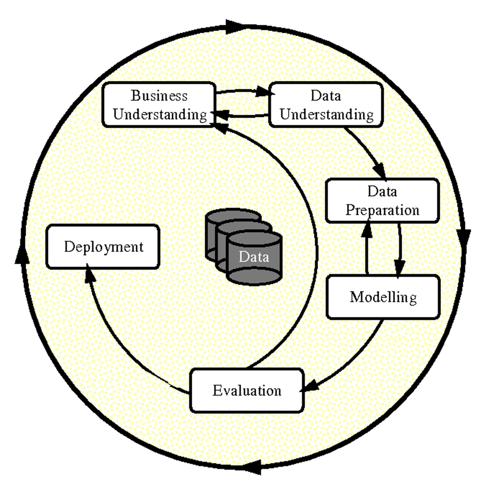

# Paper 9: CRISP-DM: Towards a Standard Process Model for Data Mining

---

Wirth, R. & Hipp, Jochen. (2000). CRISP-DM: Towards a standard process model for data mining. Proceedings of the 4th International Conference on the Practical Applications of Knowledge Discovery and Data Mining.

---

# Abstract

- The CRISP-DM (CRoss Industry Standard Process for Data Mining) project proposed a comprehensive process model for carrying out data mining projects. The process model is independent of both the industry sector and the technology used.
- The generic CRISP-DM process model is useful for planning, communication within and outside the project team, and documentation.

# Introduction

- Data mining needs a standard approach which will help translate business problems into data mining tasks, suggest appropriate data transformations and data mining techniques, and provide means for evaluating the effectiveness of the results and documenting the experience.
- The CRISP-DM process model aims to make large data mining projects, less costly, more reliable, more repeatable, more manageable, and faster.

# Why the Data Mining Industry needs a Standard Process Model

- Data Mining is a complex process requiring various tools and different people. The success of a data mining project depends on the proper mix of good tools and skilled analysts. Furthermore, it requires a sound methodology and effective project management. A process model can help to understand and manage the interactions along this complex process.

# The CRISP-DM Methodology

## Overview

- The CRISP-DM methodology is described in terms of a hierarchical process model, comprising four levels of abstraction (from general to specific): phases, generic tasks, specialized tasks, and process instances.

- The CRISP-DM methodology distinguishes between the Reference Model and the User Guide. Whereas the Reference Model presents a quick overview of phases, tasks, and their outputs, and describes what to do in a data mining project, the User Guide gives more detailed tips and hints for each phase and each task within a phase and depicts how to do a data mining project.

## The Generic CRISP-DM Reference Model

- The life cycle of a data mining project is broken down in six phases which are shown in Figure 2: business understanding, data understanding, data preparation, modeling, evaluation, and deployment.
- The sequence of the phases is not strict. […] Data mining is not finished once a solution is deployed. The lessons learned during the process and from the deployed solution can trigger new, often more focused business questions. Subsequent data mining processes will benefit from the experiences of previous ones (cf. the virtuous cycle of (Berry and Linoff, 1997)).

jeopardize a project

# Conclusion

- It is fairly easy to write specialized process models based on generic check lists.